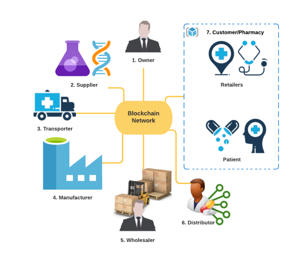

# Medicine-Supply-Chain

A supply chain for the safe distribution of medicines using Blockchain and AI.

## Explanation + Demo

## Importance

&nbsp;&nbsp;&nbsp;&nbsp;&nbsp;&nbsp;&nbsp;At present, counterfeit drugs pose a serious threat as it is difficult for people to know the true value of purchased medicines due to a significant lack of transparency in the current system. Also, tampering within the supply chain is difficult to investigate when suspicion of illegal or unethical practices. 

&nbsp;&nbsp;&nbsp;&nbsp;&nbsp;&nbsp;&nbsp;Our solution is an amalgamation of two powerful technologies - Blockchain and AI. Blockchain is an open, distributed ledger that can efficiently record transactions between two parties in a verifiable and permanent way. Since blockchains are decentralized, distributed, transparent, and immutable, they can easily solve counterfeit medicines. AI in pharmacology helps improve customer service, loyalty and enables easy access to blockchain-based medical intelligence. 

&nbsp;&nbsp;&nbsp;&nbsp;&nbsp;&nbsp;&nbsp;This project proposes a system that uses blockchain and AI for the safe supply of medical drugs throughout the supply chain. Each product within the chain can be transferred between authenticated entities of the chain using an event request-response mechanism. All transactions between entities are recorded into the blockchain using smart contracts with the help of which a product can be traced to its source. We built a Rasa chatbot integrated into a Flutter app enabling ordering, tracing back medicines, and enhancing blockchain-based credit evaluation. A DApp was then developed using React Framework. The smart contracts were deployed on a local blockchain provided by Ganache. Using Web3.js and Truffle framework, DApp is connected to the blockchain. The experimental results show that our solution is feasible and comparatively more secure than existing systems.

## System Overview

<ol>
  <li>Owner</li>
  <ol>
    <li>CREATE a new user to be added to the chain.</li>
    <li>READ the information of any user.</li>
    <li>UPDATE the roles of a user.</li>
    <li>DELETE a user from the chain.</li>
  </ol>
  <li>Transporter</li>
  <ol>
    <li>Verify the package (Raw Material or Medicine).</li>
    <li>Pick the package from an entity (based on transporter type).</li>
    <li>Deliver the product to an entity.</li>
  </ol>
  <li>Supplier</li>
  <ol>
    <li>CREATE a Raw Material.</li>
    <li>GET the addresses of the Raw Materials created.</li>
  </ol>
  <li>Manufacturer</li>
  <ol>
    <li>Receive the Raw Material from the Supplier through the Transporter.</li>
    <li>Verify the source of the product received.</li>
    <li>CREATE a new Medicine using received raw materials.</li>
  </ol>
  <li>Wholesaler</li>
  <ol>
    <li>Receive the medicine from the manufacturer through the Transporter.</li>
    <li>Verify the source of the medicine.</li>
    <li>Transfer the ownership of the medicine.</li>
  </ol>
  <li>Distributor</li>
  <ol>
    <li>Receive the medicine from the Wholesaler through the Transporter.</li>
    <li>Verify the source of the medicine.</li>
    <li>Transfer the ownership of the medicine.</li>
  </ol>
  <li>Customer</li>
  <ol>
    <li>Receive the medicine from the Distributor through the Transporter.</li>
    <li>Verify the source of the medicine.</li>
    <li>Place orders using the Rasa chatbot.</li>
    <li>Get medical drug information.</li>
  </ol>
</ol>

## Contributors

<table>
  <tr>
    <td align="center"><a href="https://github.com/sherwyn11"> <b>Sherwyn D'souza</b></a> <a href="" title="">:octocat:</a></td>
    <td align="center"><a href="https://github.com/Darlene-Naz"> <b>Darlene Nazareth</b></a> <a href="" title="">:snowflake:</a></td>
    <td align="center"><a href="https://github.com/CassiaVaz"> <b>Cassia Vaz</b></a> <a href="" title="">:sparkles:</a></td></td>
  </tr>
 </table>

## License

[MIT License Link](https://github.com/sherwyn11/Medicine-Supply-Chain/blob/master/LICENSE)
